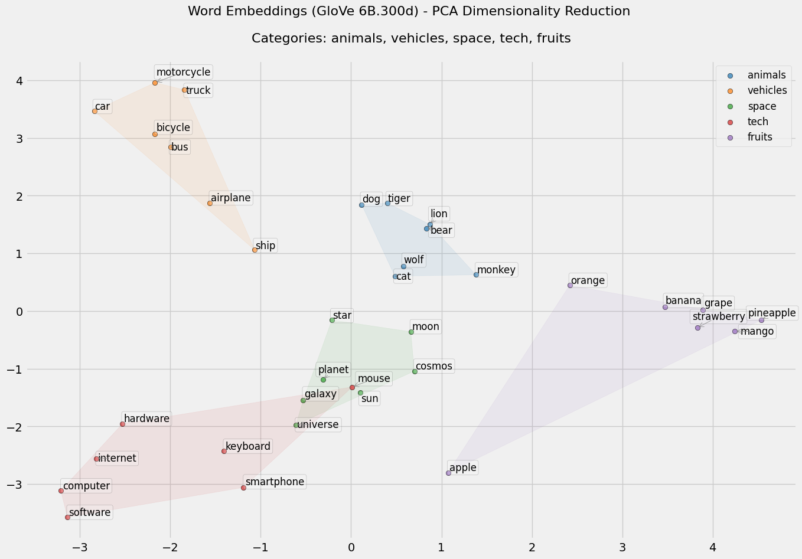
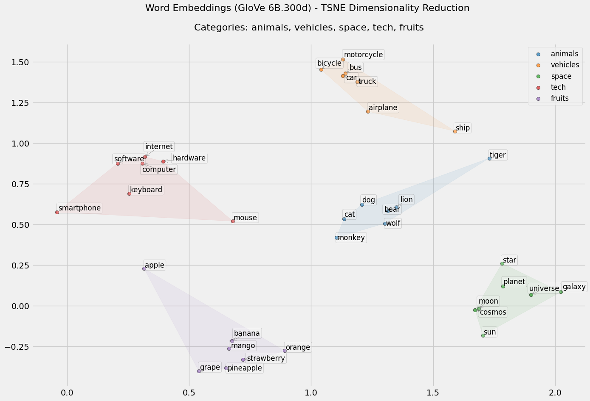

# WordEmbeddings


This repository is a hands-on exploration into the fundamentals of word embeddings. Instead of relying solely on high-level libraries (such as word2vec), I implemented key processes manually in a Jupyter Notebook. The goal is to gain a deeper, intuitive understanding of how semantic relationships are encoded in vector spaces.

## Project Overview

In this project, you will find that I:
- Convert pre-trained embeddings (from GloVe) into a Python dictionary for fast lookup.
- Compute cosine similarity to identify the most similar words.
- Perform vector arithmetic to solve analogies (e.g., “man is to king as woman is to ?”).
- Visualize word embeddings using dimensionality reduction techniques (PCA and t-SNE) to reveal natural clusters and relationships.

By implementing these steps from scratch, the notebook provides insights into:
- How pre-trained embeddings can be processed and organized.
- The mechanics behind measuring similarity in high-dimensional spaces.
- The power of vector operations in capturing semantic relationships.
- Visualization techniques that help interpret and analyze the structure of the embedding space.

## Images





## How to Use

1. **Clone the Repository:**
   ```bash
   git clone https://github.com/YourUsername/WordEmbeddings.git
   ```
2. **Install the Required Dependencies:**
   Create a virtual environment (optional) and install the dependencies:
   ```bash
   pip install -r requirements.txt
   ```
3. **Run the Notebook:**
   Open the Jupyter Notebook:
   ```bash
   jupyter notebook notebooks/word_embedding.ipynb
   ```
   Run the cells sequentially to see how the embeddings are processed, analyzed, and visualized.

## Motivation

While tools like word2vec provide automated methods for learning word embeddings, this project intentionally implements the core techniques manually. This approach helps to demystify the underlying concepts—such as vector arithmetic for analogies and the importance of co-occurrence statistics—thus offering a solid foundation for more advanced studies in NLP.

## Questions & Ideas

I invite you to reflect on the following:
- How do manual implementations compare to high-level libraries in terms of understanding the underlying processes?
- What alternative methods or additional visualizations could further enhance our understanding of word embeddings?
- Are there other ways to explore semantic relationships in language?

Feel free to share your thoughts or suggest new directions for future work!
