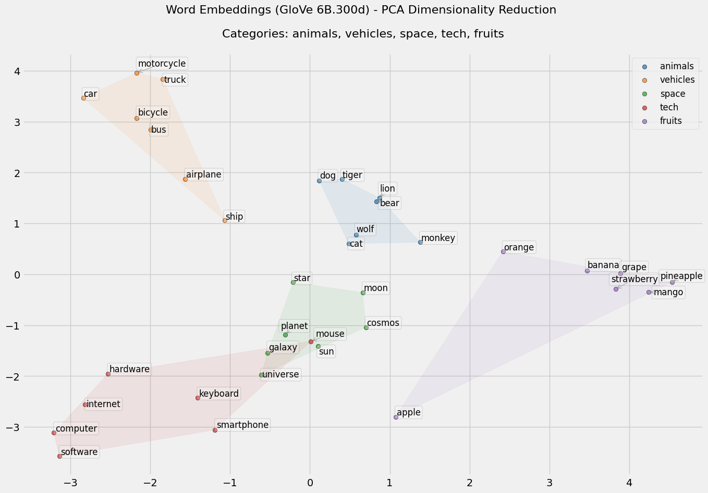
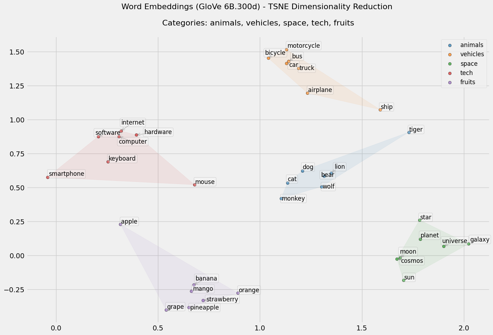

# WordEmbeddings


Este repositorio es una exploración práctica de los fundamentos de los embeddings de palabras. En lugar de depender únicamente de librerías de alto nivel (como word2vec), he implementado manualmente los procesos clave en un Notebook de Jupyter. El objetivo es profundizar y comprender de forma intuitiva cómo se codifican las relaciones semánticas en los espacios vectoriales.

## Descripción del Proyecto

En este proyecto, se realiza lo siguiente:
- Se convierten embeddings preentrenados (de GloVe) en un diccionario de Python para una búsqueda rápida.
- Se calcula la similitud coseno para identificar las palabras más cercanas.
- Se realiza aritmética vectorial para resolver analogías (por ejemplo, “man is to king as woman is to ?”).
- Se visualizan los embeddings mediante técnicas de reducción de dimensionalidad (PCA y t-SNE) para mostrar clústeres y relaciones naturales.

Al implementar estos pasos desde cero, el Notebook ofrece una visión clara de:
- Cómo procesar y organizar embeddings preentrenados.
- La mecánica detrás de la medición de similitud en espacios de alta dimensión.
- El poder de las operaciones vectoriales para capturar relaciones semánticas.
- Técnicas de visualización que ayudan a interpretar y analizar la estructura del espacio de embeddings.

## Imágenes






## Cómo Usarlo

1. **Clonar el Repositorio:**
   ```bash
   git clone https://github.com/YourUsername/WordEmbeddings.git
   ```
2. **Instalar las Dependencias:**
   Crea un entorno virtual (opcional) e instala las dependencias:
   ```bash
   pip install -r requirements.txt
   ```
3. **Ejecutar el Notebook:**
   Abre el Notebook en Jupyter:
   ```bash
   jupyter notebook notebooks/word_embedding.ipynb
   ```
   Ejecuta las celdas de forma secuencial para ver cómo se procesan, analizan y visualizan los embeddings.

## Motivación

Aunque herramientas como word2vec ofrecen métodos automatizados para aprender embeddings, este proyecto implementa de manera manual las técnicas fundamentales. Este enfoque ayuda a desmitificar los conceptos subyacentes—como la aritmética vectorial para analogías y la importancia de las estadísticas de coocurrencia—ofreciendo una base sólida para estudios más avanzados en NLP.

## Preguntas e Ideas

Te invito a reflexionar sobre lo siguiente:
- ¿Cómo se comparan las implementaciones manuales con las librerías de alto nivel en cuanto a la comprensión de los procesos subyacentes?
- ¿Qué métodos alternativos o visualizaciones adicionales podrían mejorar la comprensión de los embeddings de palabras?
- ¿Existen otras formas de explorar las relaciones semánticas en el lenguaje?

¡Comparte tus ideas o sugerencias para futuras mejoras!

